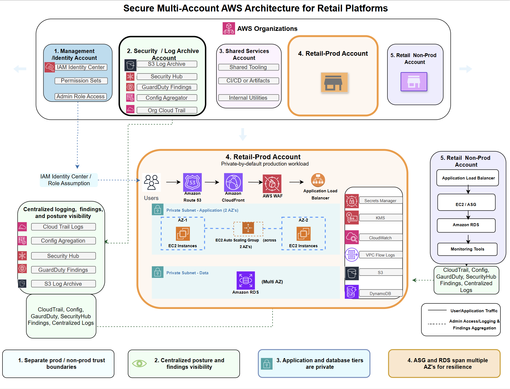

# Secure Multi-Account AWS Architecture for Retail Platforms

**Security-first AWS reference architecture for retail workloads using multi-account isolation, least-privilege IAM, centralized logging, private-by-default networking, and resilient workload design.**

## Executive Summary

This project presents a secure AWS reference architecture for a retail platform that supports customer-facing traffic, internal application services, and sensitive operational data across multiple AWS accounts.

The goal is to show how I think about designing cloud environments at the architecture level: separating trust boundaries, reducing unnecessary internet exposure, centralizing visibility, and balancing security, resilience, and operational practicality.

Rather than treating security as a checklist applied after deployment, this architecture treats security as part of the platform design itself. It uses a multi-account model, layered ingress controls, centralized logging, findings and posture visibility, least-privilege IAM, and private workload placement to support secure modernization in a realistic retail environment.

## Business Scenario

A retail organization is modernizing a platform that supports customer identity, product browsing, order workflows, internal APIs, and payment-adjacent services. The business needs stronger isolation between environments, better visibility across accounts, and a more consistent security model without overexposing workloads to the public internet.

This architecture is designed to address those needs while supporting growth, auditability, and operational resilience.

## What Problem This Architecture Solves

This reference architecture addresses several common AWS platform problems:

- weak trust boundaries between production and non-production environments
- overexposed workloads and broad ingress paths
- scattered logs and fragmented security visibility
- inconsistent IAM access patterns across accounts
- limited posture visibility and configuration governance
- weak resilience planning for application and database tiers

## Architecture Goals

- separate production and non-production trust boundaries
- centralize logging, findings, and posture visibility
- enforce least-privilege IAM and controlled administrative access
- reduce attack surface through private-by-default workload placement
- support resilient application and database design across multiple AZs
- provide a practical modernization pattern for retail workloads running on AWS

## High-Level Architecture

This design uses a multi-account AWS Organizations model with dedicated accounts for management/identity, security and log archive, shared services, retail production, and retail non-production.
Within the Retail-Prod account, traffic flows through:

**Route 53 → CloudFront → AWS WAF → Application Load Balancer → EC2 Auto Scaling Group → RDS**

Supporting services include:

- AWS Config
- CloudTrail
- GuardDuty
- Security Hub
- CloudWatch
- VPC Flow Logs
- Secrets Manager
- KMS
- optional S3 and DynamoDB components where appropriate
  
## Architecture Diagram

The diagram below shows the multi-account structure, the primary workload flow in the Retail-Prod account, and the centralized logging, findings, and posture visibility model used across production and non-production environments.

  

**Figure 1.** Secure multi-account AWS reference architecture for a retail platform with centralized logging, least-privilege IAM, private workload placement, and layered ingress controls. 

## Why This Architecture

This project is intended to demonstrate how I approach secure AWS platform design for real business workloads.

It reflects several principles I consider foundational:

- security should reinforce architecture, not be bolted onto it later
- IAM and trust boundaries drive much of cloud security posture
- centralized visibility is critical for both operations and security
- resilience and security should be designed together
- modernization should improve risk posture without forcing unrealistic replatforming

## Repository Contents

- `diagrams/` → architecture diagram and visuals
- `docs/architecture-decisions.md` → why key design choices were made
- `docs/threat-model.md` → threats, risks, and mitigations
- `docs/security-controls.md` → preventive, detective, responsive, and governance controls
- `docs/deployment-scope.md` → what is conceptual vs. what could be implemented
- `examples/sample-iam-patterns.md` → example IAM access patterns
- `examples/sample-network-segmentation.md` → example subnet and traffic segmentation patterns

## What This Project Demonstrates

- multi-account AWS architecture thinking
- secure retail workload design
- IAM and trust-boundary reasoning
- centralized logging, detection, and posture visibility
- resilience-aware cloud architecture
- security control mapping from threat to mitigation
- architect-level communication through diagrams, decisions, and documentation

## Supporting Documentation

This repository includes supporting documentation that explains the reasoning behind the architecture:

- [`docs/architecture-decisions.md`](docs/architecture-decisions.md)
- [`docs/threat-model.md`](docs/threat-model.md)
- [`docs/security-controls.md`](docs/security-controls.md)
- [`docs/deployment-scope.md`](docs/deployment-scope.md)
- [`examples/sample-iam-patterns.md`](examples/sample-iam-patterns.md)
- [`examples/sample-network-segmentation.md`](examples/sample-network-segmentation.md)